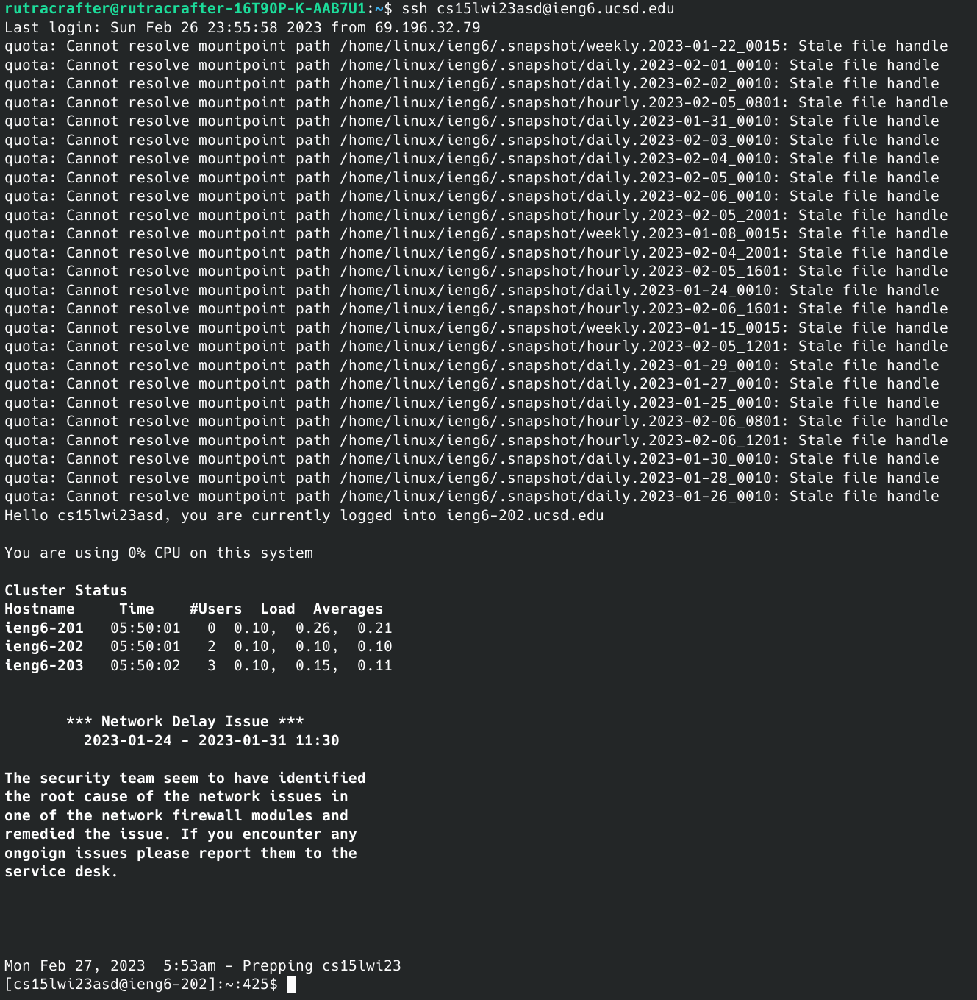
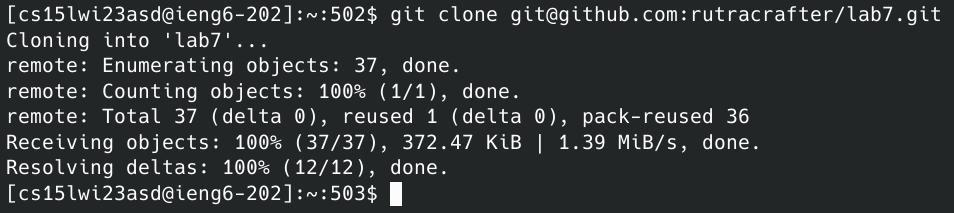
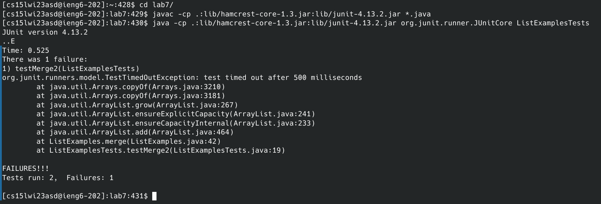
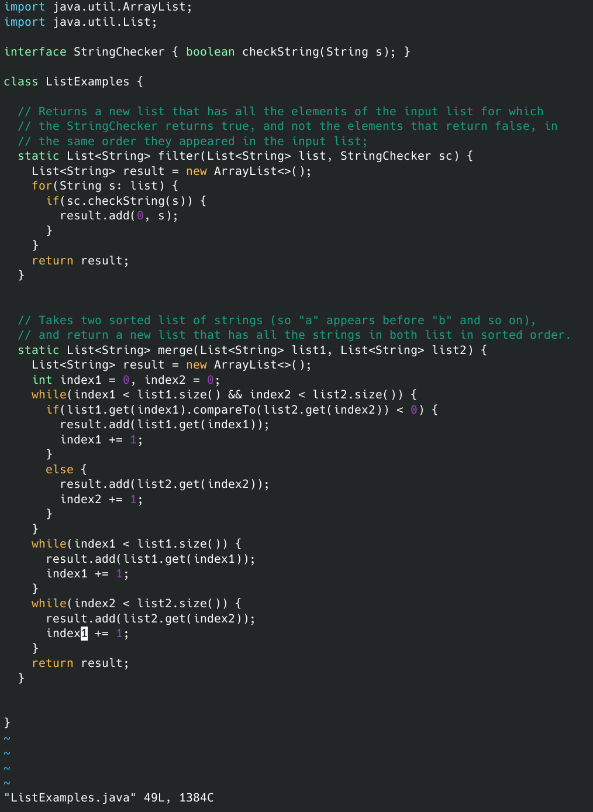
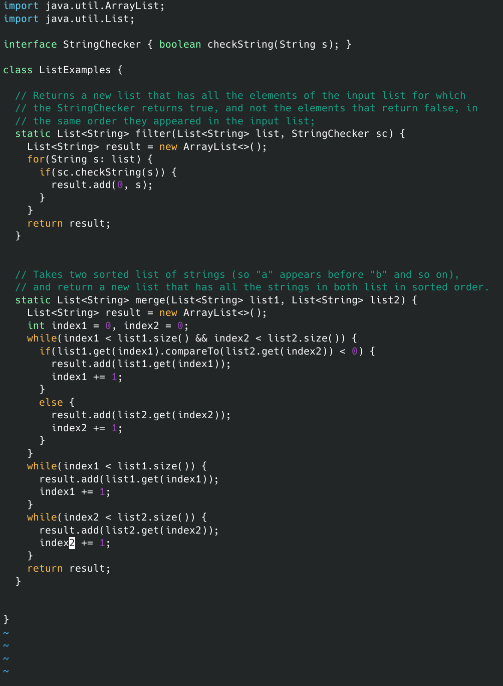
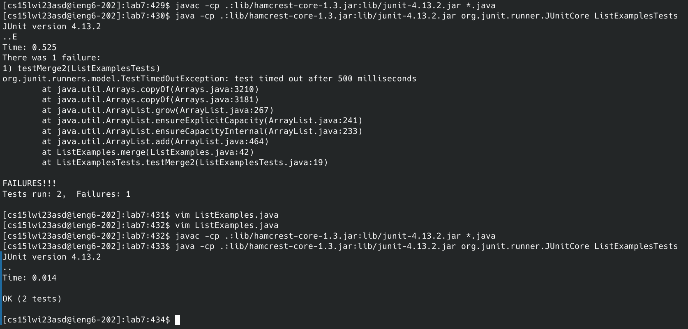
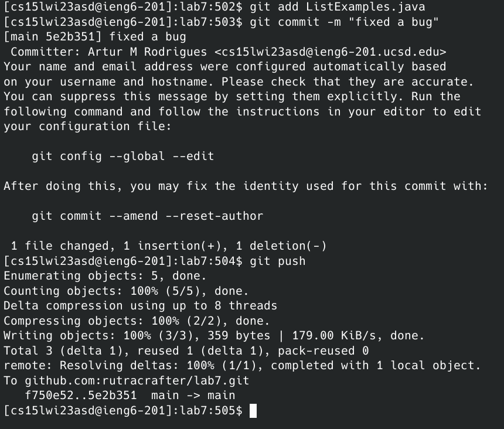

# Step 4 (starting point)
Keys pressed: `<up>` `<enter>`

I used the up arrow to access my most recent command on my local machine which was the command to ssh into my account on the ieng6 server. I then pressed enter to run the command.

# Step 5
Keys Pressed: git clone `<ctrl+c>`

I typed in `git clone` and then used `<ctrl+c>` to paste the address to the my fork of the lab7 repository which was in my clipboard from earlier.

# Step 6
Keys Pressed: cd la`<tab>` `<enter>` `<up>`x15 `<enter>` `<up>`x15 `<enter>`

I first used the `cd` command to change directory to my lab7 (used tab complete to speed things up) repository that I just cloned and then run the command by pressing `<enter>`. I used the up arrow 15 times to get the junit javac command that I had used earlier and press `<enter>` to run it. Once again I used the up arrow 15 times to get the junit java command that I had used earlier and press `<enter>`.

# Step 7
Keys Pressed: vim Lis`<tab>`.j`<tab>` `<enter>` r2 :wq `<enter>`

I typed `vim Lis` and used tab complete to get `vim ListExamples`, then I typed .j and used tab complete to get `vim ListExamples.java` and then I pressed `<enter>` to run the command.

Running the previous command opened up vim, and my vim cursor was already on top of the value that had to be changed to fix the bug, so I just had to press the r key, and the 2 key to replace the value under the cursor with the value 2.

Finally I typed :wq and pressed `<enter>` to write and quit the vim file, which has now fixed the bug.

# Step 8
Keys Pressed: `<up>`x3 `<enter>` `<up>`x3 `<enter>`

I used the up arrow 3 times to get to the previously used junit javac command, and pressed `<enter>` to run the command. Then I used the up arrow 3 more times to get to the previously used junit java command, and once again pressed `<enter>` to run the junit tests.

# Step 9
Keys Pressed: git add Lis`<tab>`.j`<tab>` `<enter>` git commit -m "fixed a bug" `<enter>` git push `<enter>`

To finalize the changes made, I added the changes we made to the `ListExamples.java` file using git add Lis`<tab>`.j`<tab>` (tab complete) and pressed `<enter>` to run the command, then I commited said changes to the github repository using 'git commit -m "fixed a bug"' and used `<enter>` to run the command, and then finally, I pushed the changes to said repository using git push `<enter>`.

